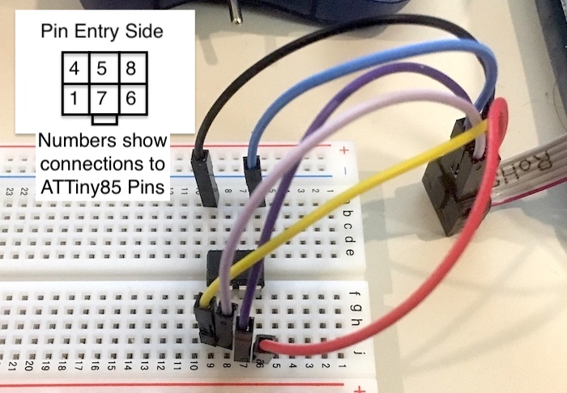
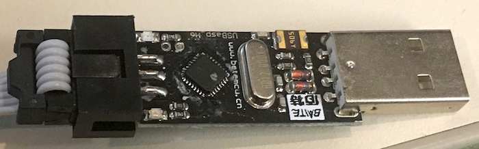
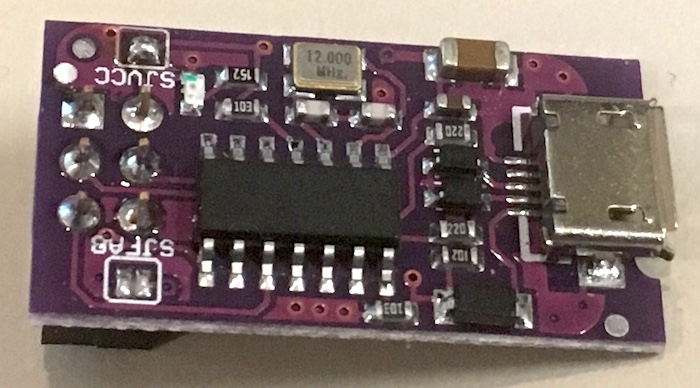
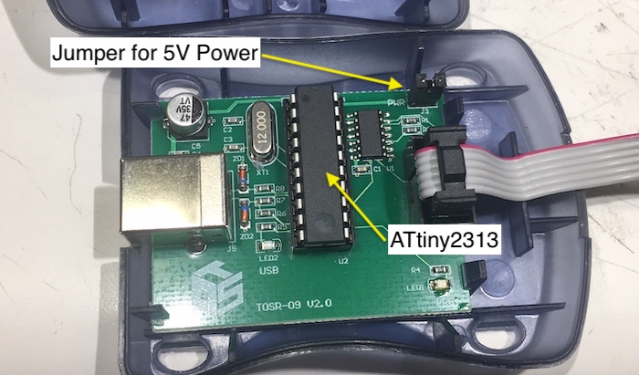

## ATTiny Hardware Programmers

If you've worked with Arduino™ boards, you'll know that that each board comes preloaded with a _bootloader_, which is a bit of code that's used copy your program to the board.  While it's possible to install a bootloader into some ATTiny devices, it's more practical to use hardware devices called _In-Circuit Serial Programmers_ (ICSP), or _In-System Programmers_ (ISP) to program the chips.  By controlling a small set of pins on an ATTiny, these programmers are able to transfer code directly into the ATTiny's flash memory. They are also able to independently program a set of special, nonvolatile registers called "fuses" that configure, or enable certain special features in the ATTiny (see the section ["Understanding Fuses"](fuses.md) for more details.)

### How Hardware Programmers Work

In brief, the ATTiny245/445/84 and ATTiny25/45/85 devices use a protocol based on the SPI interface to program the chips.  This requires using the MISO, MISO and SCK pins, as well as the RESET pin to control the device during programming.  If you want to learn more about this protocol, check out [Microchip/Atmel's Application Note
AVR910](http://ww1.microchip.com/downloads/en/appnotes/atmel-0943-in-system-programming_applicationnote_avr910.pdf) for more details.

Because of it's limited pin count, the ATTiny4/5/9/10 devices use a different protocol called the Tiny Programming Interface (TPI).  This protocol uses the TPIDATA, TPICLK and RESET pins to control the device during programming.  If you want to learn more about this protocol, check out [Microchip/Atmel's Application Note AVR918](http://ww1.microchip.com/downloads/en/AppNotes/doc8373.pdf) for more details.  Also, ATTiny10IDE is designed to use an Arduino Sketch that programs it to function as a TPI Programmer.  See the section [Programming ATTiny10 Chips](file://tiny10/programming.md) for more details.

### 5V Power and Ground and In-Circuit Programming

In addition to the programming signals, ATTiny devices require both a ground connection to the programmer as well as a source of power in order to program it.  Some programmers are designed to supply 5V power to the device and, in fact, the programmer may be configured this way by default.  However, it's also possible for the device to supply its own power during programming as long as this power is from 2.7 to 6 volts.  

Ideally, the safest way to program an ATTiny is to have only the ATTiny chip connected to the programmer.  But, this may not be possible if the device is soldered onto a circuit board.  In this case, it is possible to program the ATTiny "in circuit" as long as certain requirements are met.  First, the circuit must be designed so that none of the other circuitry on the board will interfere with the programmer's control of the MISO, MISO, and SCK pins.  Also, if your design has circuity attached to the RESET pin, such as a special low voltage, or brownout detector, this circuity must also not interfere with the programmer's control of the RESET pin.

In most cases, you won't have a problem if the MISO, MISO, and SCK pins are all used as outputs from the ATTiny.  But, if any of these pins is used as an input from some other device on the board, the output signal from this device can easily prevent the programmer from driving this pin during programming or, in the case of the MISO pin, prevent the ATTiny from sending its response back to the programmer.  One way to solve this is to put resistors in series with the connections to these other devices.  This permits the signals from the programmer and the MISO signal from the ATTiny to overpower the signals coming from the other device.  A value of 1K is usually suitable for this purpose.

Things get a bit trickier if the board is powering the ATTiny with 3.3 volts, as most programmers are designed to supply 5 volt power when programming a chip.  In this case, you may need to design in removable jumpers, or solder bridges that can be opened in order to isolate the ATTiny's signal and power connections during the programming step.  For additional information on how to design a circuit that supports "in circuit" programming, you should review Microchip/Atmel's recommendations in [AppNote AVR910: In-System Programming](http://ww1.microchip.com/downloads/en/appnotes/atmel-0943-in-system-programming_applicationnote_avr910.pdf)

### In-Circuit Serial Programmers

ATTinyIDE supports several different models of ICS Programmers but, in general, each one is designed to plug into a USB port where it is controlled by an open source program called AVRDude, which is integrated into ATTinyIDE.  The image below shows a now discontinued device called the _AVRISP mkII_, which was made and sold by Atmel.  On the other side, a 6 pin (2x3) header with .1 pin spacing is used to connect to the board containing the ATTiny device, as shown below:

The 6 pn header is keyed with a protrusion on one side that's designed to mate with a special "shrouded" connector that contains a cutout for this protrusion to prevent it form being plugged in incorrectly.  However, because of their larger size, shrouded connectors are rarely used.  Instead, a plain, 2x3 male header is most used, as they're smaller and less expensive than shrouded connectors.  This means you have to be careful to correctly orient the cable from the programmer when you connect it to the board.  Ideally, the board contains a marker on the silkscreen layer that indicates pin 1 and you then match this up with the red stripe on the cable that also indicates pins.  Note: the cables on some ICS Programmers are not marked with a red stripe, but you can fix this with a red marker pen.

_Note: In the image above, the 6 pin connector is shown from the top of the connector, which is the opposite from the side where the mating pins are inserted.  In addition, the MISO and MOSI pins on the ATTiny are labelled from the perspective of the ATTiny device being the **slave** device, which is the reverse of how these pins are labelled when the ATTiny is the **master** device, such as the case when the ATTiny is connected to an SPI device it is controlling._

Alternately, if you're building a circuit on a solderless breadboard, you can use jumper wires to connect the ATTiny device to the open connector, as shown below:

_Note: in the image above, the 6 pin connector is flipped so that the holes where the jumpers are inserted are facing up and the numbers shown inside the connector diagram at the upper left show the corresponding ATTimy85 pin to connect to._

### USBasp Programmer

Another popular and inexpensive programmer (shown below) is the _USBavr_, which is based on the ATMega88.  [Instructions are available online](https://www.fischl.de/usbasp/) that enable you to build one for yourself and programmers based on this design are widely available from a variety of online vendors, often for less that $10.  And, be aware that, should you decide to build one, you'll need an ISP Programmer to program ATMega88 used in the programmer, which is sort of a chicken and egg-type problem,

### USBTiny Programmer

The [USBTiny Programmer](https://dicks.home.xs4all.nl/avr/usbtiny/) (shown below) is another open source design that's based on the ATtiny2313 chip that, again, is widely available in many form factors from various online vendors, often for less than $10

Some vendors, as shown below, have even packaged the USBTiny design in a case that make it look like the now discontinued AVRISP mkII.  If you purchase one of these, be sure to select USBTiny and not AVRISP mkII in the Settings->ISP Programmer menu.

### Using an Arduino as an In-Circuit Programmer

Another way to program an ATTiny84 is to use an ATmega328P-based Arduino (Arduino UNO, for example) as a programmer by uploading a special Sketch called ArduinoISP, which is included with the Arduino IDE.  For more details on how to do this, see the more in-depth instructions on programming included in the sections [Programming ATTiny24/44/84 Chips](file://tiny84/programming.md) or [Programming ATTiny25/45/85 Chips](file://tiny85/programming.md)