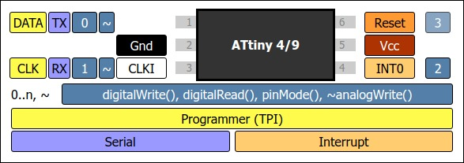
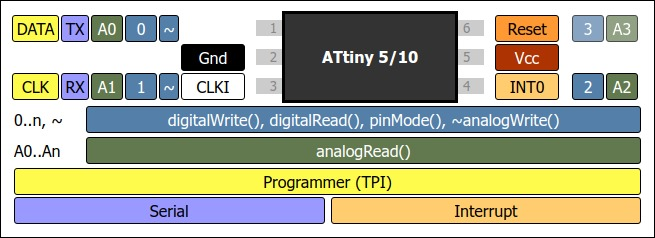
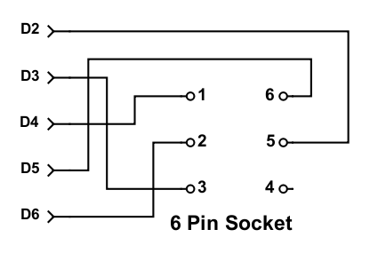

ATTiny10IDE supports coding for the ATTiny10 Series of Microcontrollers in C and C++ using the GNU AVR-C++ compiler to generate code.  In addition, ATTiny10IDE supports two ways to write and assemble code the ATTiny10.  One method uses the GNU AVR-AS assembler using a non Atmel-type syntax.  The other uses a [homebrew assembler I wrote that supports an Atmel-like syntax](https://sites.google.com/site/wayneholder/attiny-4-5-9-10-assembly-ide-and-programmer).  The file extension you choose for your code file tells ATTiny10IDE how to process the code:

    .c   - Compile as C file using avr-gcc
    .cpp - Compile as C++ file using avr-g++
    .s   - Assemble using avr-as and link with avr-ld
    .asm - Assemble with my homebrew assembler (Note: only supports the ATTiny10)
    
So, this means you'll have to save your source file with the appropriate extension before you can compile, or assemble it.  In addition, you can also write [inline assembly code](https://web.stanford.edu/class/ee281/projects/aut2002/yingzong-mouse/media/GCCAVRInlAsmCB.pdf) in a C/C++ (.c) file.  You'll find examples of these different approaches to writing code in the [GitHub examples folder](https://github.com/wholder/ATTiny10IDE/tree/master/examples).
## Introducing the ATTiny10 Series Microcontrollers
The ATTiny10 series microcontrollers include the following devices, all of which are available in 6-pin SOT and 8-pad UDFN packages in the following speed grades 0 - 4 MHz @ 1.8 - 5.5V, 0 - 8 MHz @ 2.7 - 5.5V and 0 - 12 MHz @ 4.5 - 5.5V:

+ ATTiny4 - 512 bytes Flash, 32 bytes RAM
+ ATTiny5 - 512 bytes Flash, 32 bytes RAM with 4-channel, 8-bit ADC
+ ATTiny9 - 1024 bytes Flash, 32 bytes RAM
+ ATTiny10 - 1024 bytes Flash, 32 bytes RAM with 4-channel, 8-bit ADC

All devices in the ATTiny10 Series include a 16 bit timer with Prescaler and Two PWM Channels, Programmable Watchdog Timer with Separate On-chip Oscillator and an on-chip Analog Comparator.

## Programming ATTiny10 Chips
ATTiny10IDE supports several different ways to program your compiled code into an ATTiny10 chip.  One is to build and use the [Arduino-based, High Voltage programmer/emulator](https://sites.google.com/site/wayneholder/attiny10-c-ide-and-improved-device-programmer) I designed for the original version of my IDE.  However, ATTiny10IDE also now supports a way to generate an Arduino Sketch (program) which, when run, can directly program an ATTiny10 chip using only Arduino I/O lines 2 - 6, like this:

    
Here are the steps you can follow to program an ATTiny10 using this method:
 1. Use "**`File->Open`**" to load the source file, or type your code into the "Source Code" pane and save it using the appropriate file extension.
 2. Select "**`Actions->Build`**" to compile. or assemble the code.
 3. Select "**`Actions->TPI Programmer->Generate Arduino Programmer Code`**" and save to a .ino (Arduino Sketch) file when prompted.
 4. Quit ATTiny10IDE so it does not interfere with the Arduino IDE's access to the Arduino's serial port.
 5. Load the file you generated into the Arduino (it will prompt you to create a folder for this file.  Choose Yes.)
 6. Program the Sketch into the Arduino using the "Upload" Button.
 7. Open the "**Serial Monitor**" window in the Arduino IDE (upper right button) and set the baud rate to 115200.
 8. Follow the istructions the Sketch prints to connect the Arduino to the ATTiny10.
 9. Verify the ATTiny10 is properly connected by using the Identify ATtiny10 command by typing '**`I`**' and pressing "**`Send`**".
 10. If Identify ATtiny10 responds with "Device: ATtiny10", you are clear to program the ATtiny10 by typing '**`P`**' and pressing "**`Send`**"

### Using the Sketch as an ISP Programmer

You can also use this Sketch to program as many ATTiny10s as needed with the code you generated it from in ATTiny10IDE and you can also use it as a general-purpose ATTiny10 programmer to upload and program other code, like this:

 1. First "Quit" the Arduino IDE so ATTiny10IDE will have access to the Serial Port on the Arduino running the Sketch.
 2. Start ATTiny10IDE and set "**`Settings->Serial Port->Baud Rate`**" to 115200 and "**`Settings->Serial Port->Port`**" to select the Arduino running the Sketch.
 3. Open, or write the source code you want to compile and program into the ATtiny10.
 4. Select "**`Actions->Build`**" to compile. or assemble the code.
 5. Connect the Arduino to the ATTiny10 using the same connections shown above.
 5. Select "**`Actions->TPI Programmer->Device Signature`**" to verify the ATTiny10 is properly connected.
 6. Select "**`Actions->TPI Programmer->Program Device`**" to upload and program the code into the ATtiny10.

I've also created a small, inexpensive PCB that implements the wiring shown in the above photo.  You can [order it from OSH Park](https://oshpark.com/shared_projects/ZBxayCTS), for $1.10 for three copies of the PCB.  _Note: I don't receive anything from OSH Park for offering this.  I do it just to make it a bit easier for you to program ATTiny10 chips using ATTiny10IDE._  In the following photo, the ATTiny10 is soldered to an SOT-23-6 to DIP 6 adapter PCB.  This kind of SMD to DIP adapter is widely available from many sources, or you can [order 3 copies of a SOT-23-6 to DIP 6 adapter I designed from OSH Park](https://oshpark.com/shared_projects/vuWx5EkE).  To complete the first adapter PCB you'll need two, [3 pin, .1 inch spacing female headers](https://www.pololu.com/product/1013), which serve as a socket for the SOT-23-6 to DIP adapter PCB, and a 5 pin strip of .1 inch spacing male headers, which you can snap off from a [40 pin, .1 inch breakaway header strip](https://www.pololu.com/product/965).  You also need two, 3 pin strips of the male header for the SOT-23-6 adapter PCB, too.

To use the programming adpater, simply plug it in to data pins 2 through 6 on the Arduino and then plug the SOT-23-6 to DIP adapter into the female headers on the programming adapter PCB being careful to align pin 1 to pin one on both boards.  Once programmed, the SOT-23-6 to DIP adapter makes it easy to plug it into a breadboarded circuit to test your code.
## Include `Arduino.h` to code "sketches" in ATTiny10IDE
When coding in C or C++, ATTiny10IDE expects you to put your code in a function named `main()` and handle all the details of using the low-level ATTiny10 architecture which involves ading and writing to hardware registers to perform I/O operations.  However, if your file starts by including the header file `Arduino.h`, like this:

    #include "Ardiuno.h"
    
you'll be able to write code in a way that is familiar to users of the Arduino IDE.  Instead of writing a `main()` function, your one-time initialization code will go in a function named `setup()` and code that executes again and again will go into a function named `loop()`.  Arduino calls a program like this a "sketch".  The example program `Blank.h` is a sample starting sketch you can copy to start coding.  It looks like this:

    #include "Arduino.h"

    void setup() {
      // put your setup code here, to run once:
    }
    
    void loop() {
      // put your main code here, to run repeatedly:
    }
    
#### ATTiny10 Convenience Functions
In addition, `Arduino.h` provides a set of convenience functions you can call to do digital and analog I/O in a fashion similar to how the Arduino IDE handles these operations.  These include `pinMode()`, `digitalWrite()`, `digitalRead()`, `analogWrite()`, `analogRead()`, `delay()` and `delayMicroseconds()`.  The digital I/O functions are implemented as `#define` macros, which the GNU compiler is able to efficient convert to quite optimal code.  But, be aware that you'll get the most compact and efficient code when the values passed for pin numbers resolve to constants at compile time.  For example, a call to `digitalWrite(2, HIGH)` compiles to the single instruction, `sbi	0x02,2`, in ATTiny10 assembly language.

Calls to `analogRead()` and `analogWrite()` go to actual C functions because some initialization steps are required the first time one of these functions is called.  For this reason, trying to use the same pin for both analog and digital I/o is not recommended, as the initialization code will not run a second time.  If you need to do this kind of function switching with pins, you'll need to develve into how to write code that directly manipulates the low-level I/O registers in the ATTiny10.  Note: check out some of the more advanced example programs, such as `TimerBlink.c` and `PulsingLED.c`, to see how you can use C/C++ code to directly access the ATTiny10's I/O registers.

Calls to `delay()` and `delayMicroseconds()` are also handled by `#define` macros but redirect to the [AVRlib](http://www.nongnu.org/avr-libc/) functions `_delay_ms()` and `_delay_us()`, respectively. The timing of these macros depends on the  `#pragma clock` to directive (see "Advanced Features") tell the compiler what clock speed the ATTiny10 is using, which the compiler needs to calculate the number of loop iterations needed for a specific delay.  But, by default, this is handled automatically and the clock for code using `Arduino.h` is set to 8 MHz.

If a different clock speed is needed, you can use the `clock` pragma and set it one of the following values `8000000`, `4000000`, `2000000`, `1000000`, `500000`, `250000`, `125000,` `62500`, or `31250`.  Be sure to insert the pragma before the lined that includes `Arduino.h` because code in `Arduino.h` depends on the value you select.  For example:

    #pragma clock 2000000    // Set clock to 2 MHz
    #include "Arduino.h"

Note: `analogRead()` depends on the setting of the system clock to set the clock prescaler used by the ADC, so `CLK_250000` is the lowest clock speed recommended if you are using `analogRead()`.

Note: You can also set a custom frequency using `#pragma clock` which will set the system clock prescaler to 1:1.  However, this feature is intended for use with other chips in the ATTiny family.

## Dealing with the ATTiny10's Limited RAM Space
The ATTiny10 prpovides only 32 bytes of RAM space for variables and the program call stack.  So, it's important to use `char` and `unsigned char` variables instead of `int` and `unsigned int` wherever possible and limit function call depth (recursion is not recommended), use stack variables carefully (variables declared in functions) and globally-declared arrays.  Fortunately, the AVR architecture has 32 registers available and the GNU compiler makes very eficient use of them, but there are still a few tricks that can help keep RAM usage under control.

One essential trick is [using the `PROGMEM` directive](http://www.atmel.com/webdoc/avrlibcreferencemanual/pgmspace_1pgmspace_data.html) to create `const` arrays that are stored in Flash memory rather than RAM.  This only works for read only arrays, but using it for table lookup, or strings of text makes it possible to do things would be impossible without it.  The example program `Morse.c` shows how to use `PROGMEM` to store both a lookup table for ASCII to Morse code conversion as well as for a `char[]` string for the message text.

## Advanced Experimental Features
The following sections cover advanced topics that assume you have some knowledge of the hardware architecture of the ATTiny series of microconttrollers.  To understand these sections, you should be familiar with the latest version of the [Atmel Datasheet for the ATiny4, ATiny5, ATiny9, ATiny10 8-bit AVR Microcontrollers](http://www.atmel.com/images/atmel-8127-avr-8-bit-microcontroller-attiny4-attiny5-attiny9-attiny10_datasheet.pdf).

#### Automatic Prototype Generation
If enabled in the Preferences Menu, the Build process will atempt to generate function prototypes for all functions in the main source file before running the compiler.  Note: this code is still experimental and ir currently unable to correctly parse certain C++ constructs.  Use at your own discretion.

#### Setting Fuses
I've made some non standard additions using the `#pragma` directive as a way to provide a way to send additional information to the programmer, such as to program the 3 special bits, of "fuses" in the ATTiny10's Configuration Byte.  These are:

 1. The `RSTDISBL` fuse changes the RESET pin (pin 6) into an I/O pin. which gives you 4 I/O pins instead of 3.  However, **WARNING**, if you program this fuse you'll lose the ability to reprogram the ATTiny10 until this fuse is cleared ([a special, high voltage programmer is required to do this](https://sites.google.com/site/wayneholder/attiny10-c-ide-and-improved-device-programmer)).  Also, if you do choose to use this pin for I/O it's best to use it only as an INPUT pin, since even a HV programmer can have trouble reseting the RSTDISBL fuse is pin 6 is used an an output.  Therefore, I recommend that you consider this fuse off limits until you are absolutely sure you know what you're doing, or have a stack of ATTiny10 chips to waste.
 2. The `WDTON` fuse, which forces the Watchdog Timer to alway be on.  You can enable the Watchdog Timer in software so, again this fuse is only needed for special applications.
 3. The `CLKOUT` fuse changes the function of `PORTB` `PB2` (pin 4) so that is ouputs the System Clock.
 
To set the `WDTON` fuse, for example, simply add a line like this to the top of your source file:
 
    #pragma fuses WDTON

Additional fuse names can be added using a space, or a comma to separate them.

#### Setting the Clock Rate
If you choose to use the AVRLIB function `_delay_ms()` to code software delay loops you need to tell the compiler what clock rate you intend to program into the ATTiny10 so that it can calculate the proper number of iterations for the delay loops.  To do this, add a line of like like this near the top of your source file:

    #pragma clock 8000000
    
The above line, for example, tells the compiler you intend to run the ATTiny10 at 8 MHz.  Note: using this directive does not program the ATTiny10 to run at 8 MHz.  It simply tells the compiler to assume the ATTiny10 is running at this rate.  To actually set the clock rate you'll need to add code that configures the ATTiny10's clock prescaler to an appropriate value at startup.  Note: if you're including `Arduino.h`, the clock rate is automatically set to 8 MHz.

#### Calibrating the ATTiny10's Internal Clock
This ATTiny10 contains an internal clock that's roughly calibrated at the factory.  However, the accuracy of this clock can vary with temperature and the voltage at which the ATTiny10 operates.  The accuracy of the ATTiny10's clock can be important for applications that are timing critical, such as implementing serial communication with software loops.  To more closely calibrate the clock, ATTiny10IDE has a feature that lets you run a small test program that compares the ATTiny10's clock against the Arduino's clock, which is usually set by a more precise, crystal oscillator (some Arduinos use a far less accurate ceramic "resonator" instead of a crystal and these are not recommended as a reference for calibraing the ATTiny10's clock.)

To calibrate an ATTiny10's clock, choose "`Calibrate Clock`" from the "`Actions`" menu.  This will cause ATTiny10IDE to download and run a small program to the ATTiny10 that will iteratively test various calibration values and print out the one it chooses as the best.  However, you must then add some code to your program to push this value into the OSCCAL register at startup.  See `DelayTimer.c` example program to see how this is done.  Note: each ATTiny10 will require a unique calibation value, so this step will need to be repeated for each ATTiny chip you program that requires a more accurately calibrated clock.

#### Device Selection
In many of the example source files you'll see a line of text that reads "`#pragma chip attiny10`", which is used to tell the compiler or assembler what type of AVR chip to target.  However, the ATTiny10 is the default value used if you omit this line.  In theory it can be used to select and compile for other AVR chips but ATTiny10IDE does not currently support any propgramming options for any other selections you could make.  You could use this to select one of the chips in the ATTiny10 family, such as the ATTiny4, 5, or 9, but there is little reason to do so, as these chips are less capable than the ATTiny10 and don't cost significantly less, if you are even able to purchase them.
