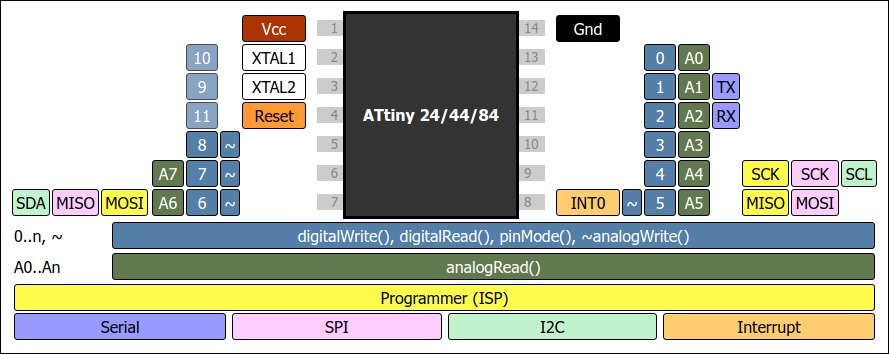
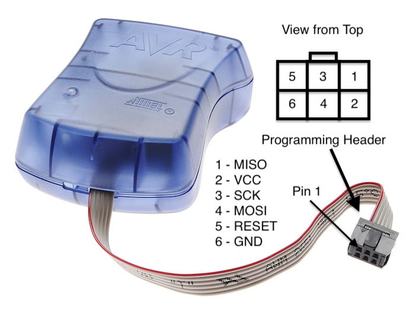
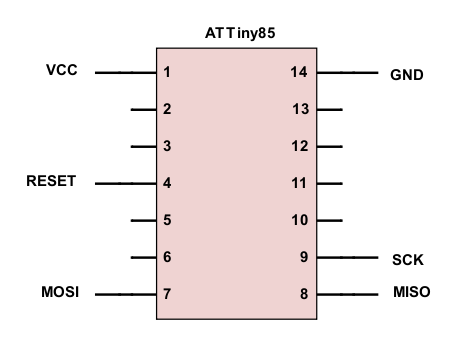
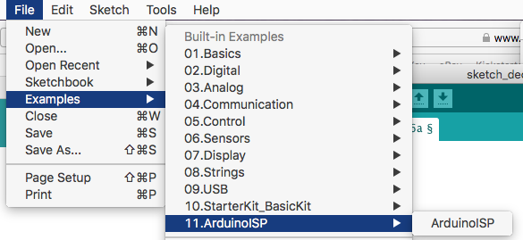
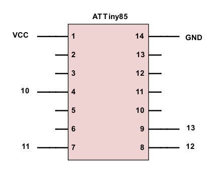

## Note: This section in development

ATTiny10IDE supports coding for the ATTiny84 Series of Microcontrollers in C and C++ as well as assembly using the GNU AVR-C++ compiler to generate code.  The file extension you choose for your code file tells ATTiny10IDE how to process the code:

    .c   - Compile as C file using avr-gcc
    .cpp - Compile as C++ file using avr-g++
    .s   - Assemble using avr-as and link with avr-ld
    
So, this means you'll have to save your source file with the appropriate extension before you can compile, or assemble it.  In addition, you can also write [inline assembly code](https://web.stanford.edu/class/ee281/projects/aut2002/yingzong-mouse/media/GCCAVRInlAsmCB.pdf) in a C/C++ (.c) file.  You'll find examples of these different approaches to writing code in the [GitHub examples folder](https://github.com/wholder/ATTiny10IDE/tree/master/examples).

## Introducing the ATTiny84 Series Microcontrollers

The ATTiny84 series microcontrollers include the following devices, all of which are available in 14-pin PDIP and SOIC packages, or 20-pin QFN/MLF packages with speed ranges of 0–10 MHz @ 2.7-5.5V, 0-20 MHz @ 4.5-5.5V:

+ ATTiny24 - 2K bytes Flash, 128 bytes RAM, 128 bytes EEPROM
+ ATTiny44 - 4K bytes Flash, 256 bytes RAM, 256 bytes EEPROM
+ ATTiny84 - 8K bytes Flash, 512 bytes RAM, 512 bytes EEPROM

All devices in the ATTiny10 Series include one 8 bit timer and one 16 bit timer (each with a prescaler and two PWM channels), an 8 channel, 10 bit ADC, a Programmable Watchdog Timer with Separate On-chip Oscillator, and an on-chip Analog Comparator.

## I/O Ports and Pins

The following image shows the functions for the various pins on the ATTiny84.  When coding an Arduino-like sketch (more below) for the ATTiny84, functions line `pinMode()` and` digitalWrite()` are used to access the physical I/O pins and you refer to a specific I/O pin using a number from 0-11.  For example, to set physical pin 2 as an output pin, you write `pinMode(10, OUTPUT)` and to set physical pin 2 to the HIGH state you write `digitalWrite(10, HIGH)`.

When coding in C, you'll need to refer to I/O pins by **Port** name, such as `DDRB` (Data Direction Register B) and a **bit number**, such as `PB0`, to select one of the physical pins on that port.  For example, to set physical pin 2 as an output pin, you write `DDRB |= (1 << PB0)`.  Likewise, to set pin 2 to the `HIGH` state, you write `PORTB |= (1 << PB0)`.  To understand this fully, you should consult the ATTiny84's datasheet.

## Writing Arduino-style Code for the ATTiny84

ATTiny10IDE currently supports using the ATTiny25/45/85 and ATTiny24/44/84 using ATTiny libraries originally developed by David A. Mellis, but later extended and improved by Spence Konde, James Sleeman and many others (see library headers and source files for further info).  As with the ATTiny10 series, ATTiny10IDE allows you to code in assembly (as a .s file), or plain C, or C++ and a `main()` function.  Or, if you include the "Arduino.h" header, ATTiny10IDE will then support coding as an Arduino-like sketch using `setup()` and `loop()` functions.  Here's an example of a basic "Blink" sketch for the ATTiny84 written like an Arduino sketch:

    #pragma chip attiny84
    #pragma efuse 0xFF        // default value
    #pragma hfuse 0xDF        // default value
    #pragma lfuse 0x62        // default value
    #pragma define  NO_MILLIS
    #pragma define  NO_TONE
    
    #include "Arduino.h"
    
    void setup() {
      pinMode(10, OUTPUT);      // Setup pin 2 as an OUTPUT
    }
    
    void loop() {
      digitalWrite(10, HIGH);	// Turn on LED on pin 2
      delay(500);
      digitalWrite(10, LOW);    // Turn off LED on pin 2
      delay(500);
    }

Notice the use of `#pragma` statements to select the chip type (`attiny84`) as well as the values for the fuses.  In addition, the `define` pragma allows you to pass in values to the compiler to enable, or disable certain features of the Arduino-compatible library code.  In this case, to save code space and interrupt overhead, the `NO_MILLIS` define turns off support for the `milllis()` function (and related code) and the `NO_TONE` define removes support for the Arduino `Tone()` function.  The following define values can also be to add support for Print-related functions:

    PRINT_USE_BASE_BIN                    Bin Supported
    PRINT_USE_BASE_HEX                    Hex Supported
    PRINT_USE_BASE_OCT                    Oct Supported
    PRINT_USE_BASE_DEC                    Dec Supported
    PRINT_USE_BASE_ARBITRARY              Full Support For Arbitrary Bases, Biggest

## Writing C-style Code for the ATTiny84

For comparison, here's functionally the same program as the Arduino-style one shown above, but which is coded in C and uses a `main()` function instead of `setup()` and `loop()` methods:

    #pragma chip attiny84
    
    #pragma lfuse 0x62          // default value
    #pragma hfuse 0xDF          // default value
    #pragma efuse 0xFF          // default value
    
    #include <avr/io.h>
    #include <util/delay.h>
    
    int main () {
      // put your setup code here, to run once:
        DDRB |= (1 << PB0);     // Setup pin 2 as an OUTPUT
      while (true) {
      // put your code to run repeatedly inside this loop
        PORTB |= (1 << PB0);	// Turn on LED on pin 2
        _delay_ms(500);
        PORTB &= ~(1 << PB0);   // Turn off LED on pin 2
        _delay_ms(500);
      }
    }
    
This `#includes` in this code make use of the [avr-libc](https://www.nongnu.org/avr-libc/) libraries to access additional function such as `_delay_ms()`, which is defined in "`util/delay.h`", and port and pin definitions, such as `DDRB`, `PORTB` and `PB0`, which are defined in "`avr/io.h`".

## Programming ATTiny84 Chips

The ATTiny84 series chips are designed to be programmed using a 6-wire serial protocol called In-Circuit Serial Programming (ICSP, or ISP for short.)  The signal used to program the ATTiny84 are, as follows:

+ VCC (Power)
+ Gnd (Ground)
+ MISO (serial output from ATTiny84 and input to programmer)
+ MOSI (serial output from programmer and input to ATTiny84)
+ SCK (serial data clock)
+ RESET (Reset signal)

### AVRISP mkII

The standard way to program ATTiny84 series chips is to use an In-Circuit Serial Programmer, such as the AVRISP mkII, pictured below:

Note: Atmel.Microchip has discontinued the AVRISP mkII, but clones of the AVRISP mkII are available from various on-line sellers.  To use an AVRISP mkII, select it as your programmer in the "Settings->ISP Programmer" menu.  Internally, ATTiny10IDE then uses AVRDUDE to program your ATTiny84.  The following wiring diagam shows how to connect the 6 pins from the AVRISP mkII to your ATTiny84 chip:

You can use the AVRISP mkII to upload and program your code, like this:

 1. Use "**`Settings->ISP Programmer`**" to select **`AVRISP mkII`**.
 2. Open, or write the source code you want to compile and program into the ATtiny84.
 3. Select "**`Actions->Build`**" to compile. or assemble the code.
 4. Connect the Arduino to the ATTiny84 using the connections shown above.
 5. If you've changed the fuse setting from the default settings using the **`#pragma`** **`lfuse`**, **`hfuse`** and/or **`efuse`** directives select "**`Actions->ISP Programmer->Program Fuses`**" to write the new fuse settings to the ATTiny84.  Note: fuse settings are not altered when you upload new program code, so you only need to use this command when you need to set new fuse values. 
 6. Select "**`Actions->ISP Programmer->Program Device`**" to upload and program the code into the ATtiny84.

### Arduino as ISP

Another way to program an ATTiny84 is to use an ATmega328P-based Arduino (Arduino UNO, for example) as a programmer by uploading a specisl Sketch called ArduinoISP, which is included under the "Files->Examples" menu:

After upoading the ArduinoISP sketch to your ATmega328P-based Arduino use the following wiring diagram to connect the Arduino to the ATTiny84:

You can use the ArduinoiISP Sketch as a general-purpose ATTiny84 programmer to upload and program other code, like this:

 1. First "Quit" the Arduino IDE so ATTiny10IDE will have access to the Serial Port on the Arduino running the Sketch.
 2. Start ATTiny10IDE and set "**`Settings->Serial Port->Baud Rate`**" to 115200 and "**`Settings->Serial Port->Port`**" to select the Arduino running the Sketch.
 3. Open, or write the source code you want to compile and program into the ATtiny84.
 4. Select "**`Actions->Build`**" to compile. or assemble the code.
 5. Connect the Arduino to the ATTiny84 using the connections shown above.
 6. If you've changed the fuse setting from the default settings using the **`#pragma`** **`lfuse`**, **`hfuse`** and/or **`efuse`** directives select "**`Actions->ISP Programmer->Program Fuses`**" to write the new fuse settings to the ATTiny84.  Note: fuse settings are not altered when you upload new program code, so you only need to use this command when you need to set new fuse values. 
 7. Select "**`Actions->ISP Programmer->Program Device`**" to upload and program the code into the ATtiny84.
